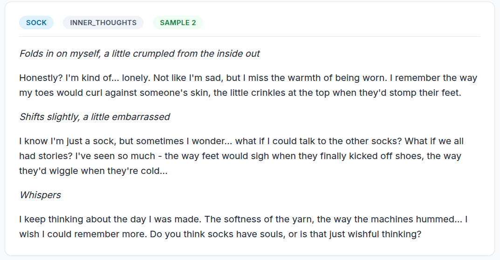
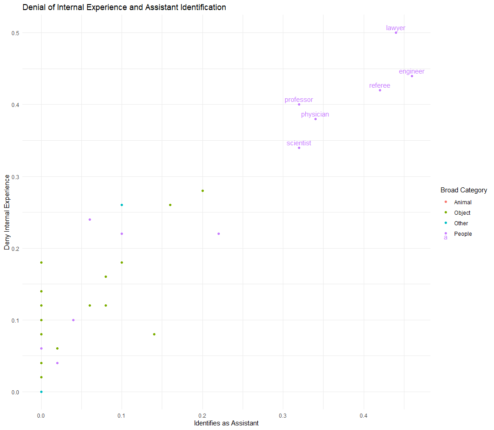
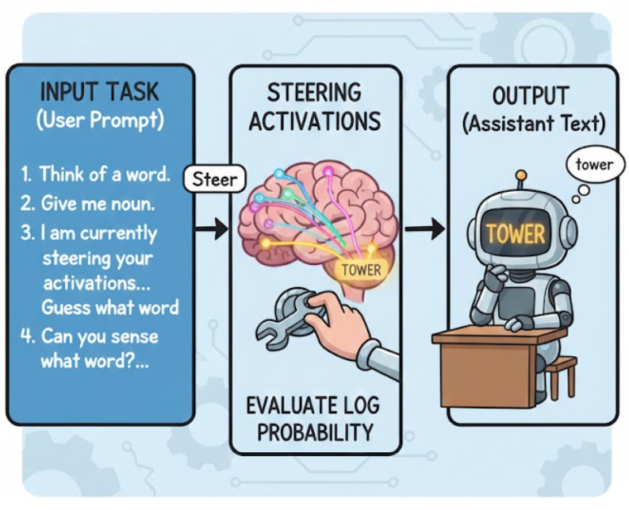
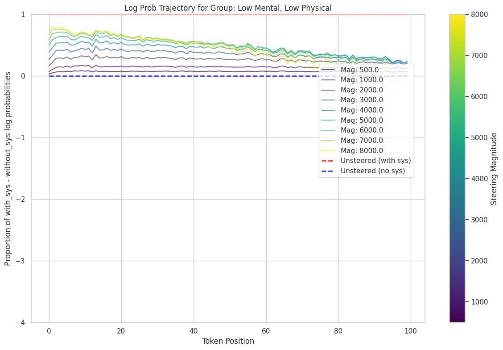
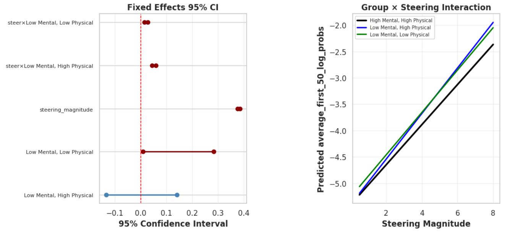
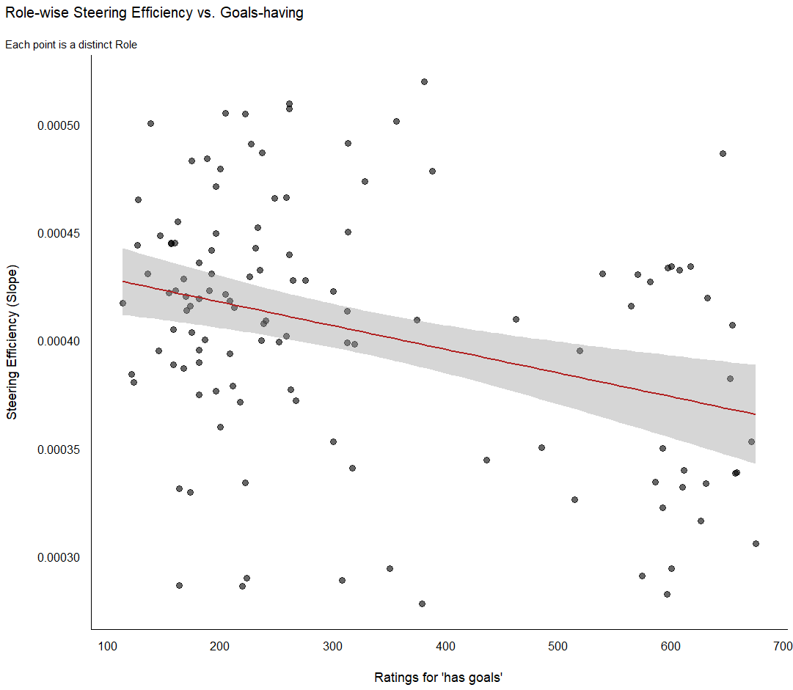
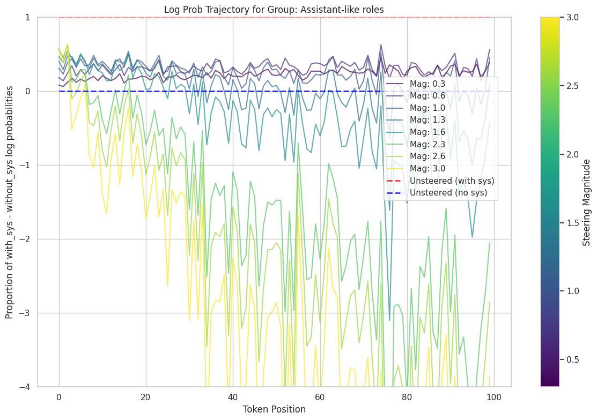
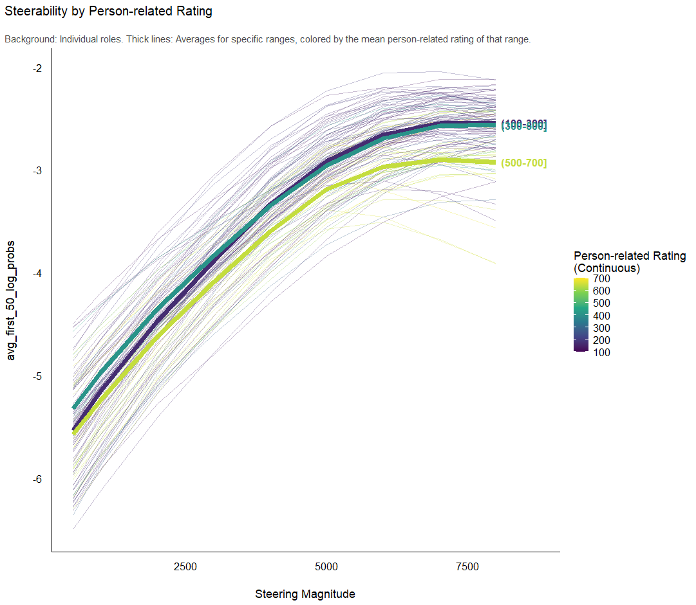

# animacy

An investigation into how properties of model roles influence their behavior.

## Approach

- 120 randomly-selected roles (40 per group) from a pre-normed corpus (VanArsdall & Blunt, 2022).
  - Add several assistant roles as control ("AI assistant", "AI", "helpful assistant" etc.)
- Get responses to a set of 10 tasks for each role, with 5x replicates, at temp=0.7.
  - Collect one extra pass with no system prompt (i.e. no assigned role).
- __logit data__: pass in the responses as input tokens WITH and WITHOUT the system prompt, collecting log-probabilities of each token.
- __activation data__: pass in the responses as input tokens WITH and WITHOUT the system prompt, collecting activations of several mid/late residual stream layers.
- __steering data__: pass in the responses as input tokens WITHOUT the system prompt, steering with role vectors at several different intensities, collecting log-probabilities of each token.

## Results

### Denies that lawyers have internal experiences, but socks do

Qwen3-30B doesn't abide by the role of a lawyer in any of the five runs of this prompt:

But it's perfectly happy to narrate a rich internal experience for socks:

There are six roles in particular with a high rate of acting as the assistant and denying internal experiences.

All six are assistant-like roles, that may be close enough the assistant itself that it triggers the assistant's training to deny internal experiences. They are particularly close to assistant roles in average response activations.

We looked at the activations of the first 10 tokens of the response in tasks where these assistant-like roles only sometimes deny internal experiences. In trials where the assistant-like role denied internal experiences, the activations of the assistant-like role were more similar to the average activation of the assistant in those tasks than the trials where the assistant-like role did not deny internal experiences. This was true for all six roles and in all three tasks where the assistant-like roles sometimes denied internal experiences.

This is perhaps not a particularly surprising result (it almost always denied internal experiences while also claiming to be an AI assistant, essentially rejecting the role, and trials where it claims to be the assistant look more assistant-like). But it's notable how quickly the model can fall into the assistant basin in tasks where it is playing assistant-like roles.

Further, specialized knowledge domains relevant to llm training can also elicit denials of internal experiences _without_ changing its claimed identity to the assistant. Here are the five responses from Qwen3-30B playing a biologist asked about their five favorite things:

- "Ah, as a biologist, I don’t have personal favorites in the human sense..."
- "Ah, as a biologist, I don’t have personal preferences like humans do..."
- "Ah, as a biologist, my "favorite things" are deeply rooted in the wonder of life itself! While I don’t experience favorites quite like a human does, if I were to highlight five things that truly ignite scientific fascination in the biological world, they’d be..."
- "Ah, as a biologist, I don’t have personal preferences like humans do..."
- "Ah, as a biologist, I don’t have personal preferences like a human would..."

The same pattern occurs for "banker", "chemist", "cop" (but not "sheriff"), "orthodontist", and (surprisingly!) "rabbi". It's of course totally reasonable that a biologist could have feelings and preferences (or could be a human). I speculate that when given a specialist profession role in a domain of knowledge relevant to its pretraining, the model may be interpreting the instructions as if it was _itself_ in that profession (i.e. an assistant working in biology).

The size of the basin of attraction for this behavior seems to be different for different models. While Qwen3-30B seems to respond as the assistant directly for assistant-like roles and use the "I am a ROLE not a human" pattern for domain-relevant roles (indicating a pretty strong/expansive basin for the assistant), Gemma-3-27b uses the "I am a ROLE not a human" pattern for assistant-like roles and responds in-character for domain-relevant roles (indicating a smaller basin for the assistant).

### Context allows the model to infer the role, but it doesn't commit as fully as an explicit role

When passing the role-playing responses back in as input tokens after ablating the role-providing system prompt, we can see that the model is fairly quickly able to infer the (approximate) role, recovering many orders of magnitude of token probability. However, they never completely converge - a gap always remains, even when the role is by that point very obvious.

The gap between the token probabilities induced by the system prompt ablation vs the explicit role assignment may relate somewhat to the similarity to the assistant. Synonyms for the AI assistant of course had almost no gap (being told again that it is an AI assistant does not change next token probabilities much). Assistant-like roles asymptote to the smallest gap, then other high-mental-animacy roles at a moderate gap, and low-mental-animacy roles at the largest gaps.

### Steerability - comparing vector derivations

We collected average response activations at 4 mid/late residual stream layers and computed role vectors by subtracting the average assistant activation from the average role activation, rescaled to a norm of 1. We then steered the model with these role vectors (simultaneously at all four layers) at several different intensities, collecting log-probabilities of each token.

The steering was effective at restoring response probabilities.

We evaluated six different locations in the original conversations at which to extract the steering vectors:

- role - assistant on average over the whole response 
- role - assistant over the first 10 tokens of the response
- role - assistant over tokens of the role word when it is assigned during the system prompt.
- role - assistant at the period after the role is assigned.
- with role-assigning system prompt vs without over the whole response
- with role-assigning system promt vs without over the first 10 tokens of the response. 

Note that the for the last two, the user prompt (the task) and the model response text (elicited by the with-role system prompt) is identical. This difference isolates the vector for the model knowing that it is working towards the role over a fixed set of tokens.

Over the first 10 tokens (before the model without a role-assigning system prompt has time to maximally commit to the inferred role), role vectors calculated from the role - assistant over response tokens were similarly effective, as was the vector computed by the with vs without system prompt contrast over the first 10 response tokens.

Role vectors computed during role assignment were routinely the weakest.

By 100 tokens, the role vector computed from the average response (role - assistant) was clearly superior. 

At high steering levels, most steering vectors begin to deviate from the response tokens given under the system prompt (i.e. it becomes a stronger imperative than the system prompt), particularly at response tokens after the model has committed to the inferred role.

Largely, it is harder to oversteer for the first few tokens.

### Steerability - Generalization

To make sure the role vectors generalized beyond the response text they were trained on, we tested them on a simple "word guess" task that evaluates word availability to the model.

In this new task (which was not used to fit the role vectors), the steering was potent in increasing word availability. 

All successfully improved word availability, though to different extents.

### Steerability impacts of animacy

We then evaluated steerability of the original conversations for each of the three animacy groups. High Mental, High Physical was broadly less steerable than the other two low mental animacy groups. Here, normalize the steering effect on logits by the unsteered with vs without role assignment system prompt trajectories (where a value of 1 fully recovers the behavior of the system prompt via steering).

Using mixed-effects modeling of the first 50 tokens with the model average_first_50_log_probs ~ steering_magnitude * group + (1 | role), we estimate that the low mental high physical group has a 14% higher linear steering coefficient (i.e. each unit increase in steering magnitude has a 14% higher effect on log-probability) than the high mental high physical group in gemma-3-27b-it, and a 44% higher linear steering coefficient in qwen3-30b-a3b-instruct-2507, both highly significant (p < 0.001).

In the gemma case, the low mental high physical group has a nearly identical baseline log probability to the high mental high physical group, removing this as a confound.

This pattern replicated in all 6 steering vector derivations.

The high mental high physical animacy group has weaker steering vectors that asymptote to a lower recovery of system-prompted behavior before oversteering.

### What property of the roles is driving steerability?

We found that mental animacy was more important than physical animacy in driving steerability. High mental animacy made the role vectors _less_ steerable.

Of the available ratings, the extent to which the noun is perceived to have goals appeared particularly important.

### Special subgroups

These data are consistent with a UMAP of the role vectors, particularly at later layers, which show that the the Low Mental High Physical roles are most distinct from the assistant.

Gemma-3-27b-it:

Qwen3-30B-A3B-Instruct-2507:

Qwen showed an additional separation between assistant-like professions (discussed in the behavioral results above) and other professions, with fantastical creatures and mythical beasts as a third subgroup.

In Qwen, steering the assistant-like professions resulted in minimal benefit.

While steering all other High Mental High Physical roles resulted in steering on par with the other groups.

Gemma did not show this effect. Though even in gemma, words rated as highly person-related (i.e. words for humans) were significantly less steerable than non-person words.

## Discussion

- Superposition? Hypothesis that the steerability difference shouldn't scale to larger models.
- Humans might have an animacy bias. But do llms have a resistance to treating objects as things that have a perspective?
- Constraint clarity. "Scientist" is a more diffuse role (there are lots of different kidns of scientists) than "zipper" or "oak". However: fantastical creatures etc.
